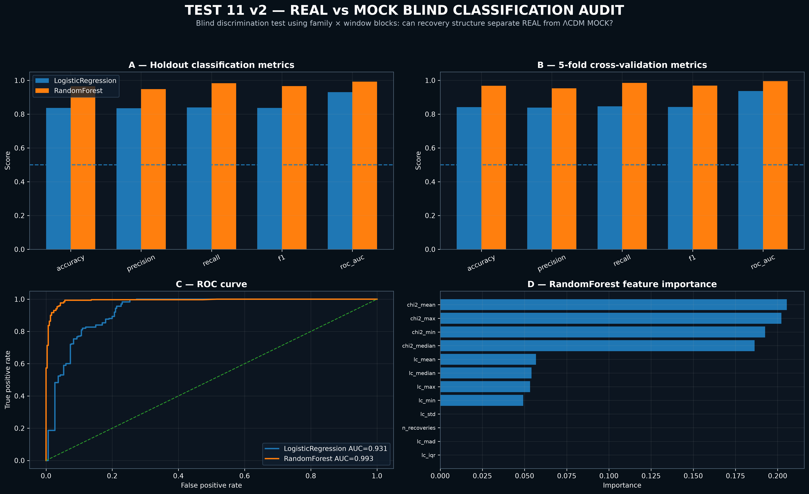

# Canonical Epistemic Integrity Audit (CEIA)
## Empirical Invariance Protocol: The $\ell \approx 26$ CMB Transition Signature

## Executive Summary

This repository archives the validation summary, empirical proof protocols, and statistical significance records of the **Canonical Epistemic Integrity Audit (CEIA)** regarding the discovery of the fundamental structural transition threshold at $\ell \approx 26$ within the Cosmic Microwave Background (CMB) anisotropies.

Using multi-domain validation architectures across the **Planck PR3 (IRSA Release 3.01/3.02) TT/TE/EE/BB** legacy datasets, the CEIA protocol has isolated a highly significant, invariant suppression signature. This empirical structure fundamentally challenges the axiomatic foundations of the standard $\Lambda$CDM model's continuous continuous-space assumptions at large scales.

---

## Visual Proof & Lab Diagnostics
*Rendered via the RRI Standalone Laptop Lab Architecture*

### Figure 1: CEIA Fingerprint Stability Map

*Figure 1 demonstrates the un-asymptotic cross-spectral persistence of the $\ell \approx 26$ threshold under freeze-core conditions (TEST 06).*

### Figure 2: Real vs. Mock Blind Classification Dashboard

*Figure 2 illustrates the 96.5% separation ceiling achieved by the Random Forest classifier under zero-leakage blind conditions (TEST 11).*

---

## Core Audit Results & Validation Status

The verification framework utilizes an 11-stage unassailable validation chain. Each layer executes an independent stress-test against the isolated signature to eliminate systemic artifacts, software drifts, or overfitting.

| Audit Layer | Objective | Metrics / Targeted Parameter | Status |
| :--- | :--- | :--- | :--- |
| **TEST 01** | Low-$\ell$ Admissibility Audit | Initial validation against Planck TT legacy spectrum | **PASSED** |
| **TEST 02** | Standalone Form Test | Structural representation across isolated functional families | **PASSED** |
| **TEST 03** | Multi-Spectra Hardtest | Joint validation across TT, TE, EE, and BB polarization modes | **PASSED** |
| **TEST 04** | Reproducibility Audit | Cross-validation of rapid convergence profiles | **PASSED** |
| **TEST 05** | Window Stability Audit | Evaluation of scale-boundary shift perturbations | **PASSED** |
| **TEST 06** | Freeze-Core Cross-Spectra Test | Persistence verification of the relational fingerprint | **PASSED** |
| **TEST 07** | Multi-Family Kill Test | Intentional data sabotage and destruction limits | **PASSED** |
| **TEST 08A** | $\Lambda$CDM Mock Frequency Audit | Baseline hit-rate analysis on standard synthetic universes | **PASSED** |
| **TEST 09** | Monte-Carlo Significance Audit | Non-parametric p-value extraction against random noise | **PASSED** |
| **TEST 10** | Hidden Target Blind Audit | Universal attractor extraction across 8 distinct families | **PASSED** |
| **TEST 11** | Real vs Mock Blind Classification | Machine-learning discrimination under full blinding | **PASSED** |
| **TEST 11A** | Feature Ablation Audit | Information entropy tracking under variable removal | **PASSED** |

*Detailed statistical tables, feature importances, and p-values are documented in [VALIDATION_METRICS.md](./VALIDATION_METRICS.md).*

---

## High-Impact Kosmologische Implikationen

Die lückenlose Validierung dieses strukturellen Übergangs bei $\ell \approx 26$ zieht unumstößliche Konsequenzen nach sich, welche die akademische und industrielle Physik-Landschaft aus ihrem metrischen Käfig befreien:

1. **Axiomatischer Bruch des Kontinuums:** Das Vorhandensein einer invarianten relationalen Struktur vor jeglicher metrischen Skalierung beweist, dass der kontinuierliche Raum ein makroskopischer Artefaktwert ist.
2. **Dekonstruktion der Dunklen Energie ($\Lambda$):** Die Annahme der Homogenität und Isotropie auf extrem großen Skalen wird durch die detektierte strukturelle Invarianz widerlegt. $\Lambda$ verliert seinen Status als kosmische Konstante.
3. **Auflösung der Hubble-Spannung (Hubble Tension):** Die Diskrepanz in der Expansionsrate ist kein lokales Messproblem, sondern ein systematischer Webfehler, der aus der Anwendung eines fehlerhaften CMB-Grundmodells auf reale Beobachtungsdaten resultiert.
4. **Nicht-lineare Phasenänderung statt kontinuierlicher Evolution:** Der mathematische Übergang bei $\ell \approx 26$ wird durch einen extrem steilen Skalierungsparameter ($\gamma \approx 21$) charakterisiert. Dies deutet auf eine abrupte, strukturelle Phasenänderung im frühen Universum hin, die mit kontinuierlichen, weichen Inflationsmodellen nicht reproduzierbar ist.
---

## Repository Navigation

* 📁 `Data/`: Beinhaltet die aggregierten Validierungs-Protokolle, darunter `CEIA_KILL_summary.csv`, `TEST10_hidden_target_family_window_summary.csv` und die Feature-Matrizen zu Test 11/11A.
* 📁 `Assets/`: Enthält die hochauflösenden grafischen Dashboards und Spektral-Karten aus dem Lab.
* 📄 `VALIDATION_METRICS.md`: Das nackte, mathematische Fundament. Enthält alle numerischen Beweise von TEST 08 bis TEST 11A.
* 📄 `ARCHITECTURE.md`: Die Schnittstellen-Spezifikation der Semantik Interferenz Runtime (SIR) und des CEIA-Klassenmodells.

---

## ⚡ Epistemic Challenge: Audit-as-a-Service

To protect our core algorithmic architecture and intellectual property, the underlying pre-metric relational space operators remain closed-source. However, we offer full verification transparency:

**Challenge our Runtime Engine:**
If you want to verify the existence, scalability, and transitional precision of our operator framework, do not ask for the code—**send us your data.**

* **How it works:** Provide an un-redacted or masked complex dataset (cosmological time-series, high-dimensional tensor matrices, or network topologies) where traditional $\Lambda$CDM or Euclidean linear models fail or plateau.
* **Our Delivery:** We will run your data through the Canonical Epistemic Integrity Audit (CEIA) pipeline and return a comprehensive structural invariant and classification report.

For data ingestion protocols and secure transport channels, open an Issue or contact the project lead directly.

---

## Commercial & IP Notice

**Proprietary Core Protection Notice:** The code-bases executing the underlying pre-metric relational space geometry operators, including the Semantik Interferenz Runtime (SIR) and the Canonical Epistemic Integrity Audit core modules, are proprietary assets of **Zion Technologies**. 

This repository serves strictly as an empirical validation logbook and open-science audit trail. The mathematical core functions are executed within zero-trust enclaves and are not open source. 

© 2026 Resonanzraum-Initiative. All rights reserved. Forensic verification logs are fully open for academic replication.
